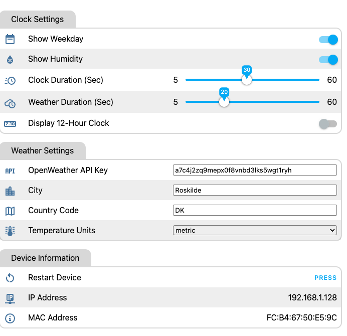

# ESPTimeCast for ESPHome

Based on @mfactory-osaka Arduino code I have created a version that will work with an ESP32 compiled through [ESPHome](https://esphome.io/)

Eventually there will be 2 versions:

1. A version that is more or less a 100% copy of the Arduino version
2. A version that will work with Home Assistant, and pull all data from there.

Currently only no 1. is available, but I am working on the version for Home Assistant.

## Hardware

I really like the case design done by @mfactory-osaka so I have made sure that boards I have tested fit in to the 3D printed casing, but if you design your own, you can use whatever ESP32 you like, as long as it can support the MAX7219 display.

For my testing, I have tried both with a **Wemos ESP32 D1 Mini** and a **ESP32 DEVKITV1**. The default PIN Layout in the YAML file is set for the Wemos ESP32 D1 Mini, but you can change these to the correct PIN's for the specific board you end up using,

For the Display, I have used the same *MAX7219* display as for the Arduino version, as this is also supported in ESPHome.

## Setup Device

You must have [ESPHome](https://esphome.io/) installed already and I will not here describe how to create a new Device as this is already covered in the ESPHome documentation.

* Once you have a new device, edit it, and paste the code from `esp-time-cast.yaml` in to the file, overwriting everything that is in there.
* Make sure you have the [MatrixLight8 Font File](https://github.com/trip5/Matrix-Fonts/blob/main/8-series/MatrixLight8.bdf) downloaded and copied to a directory in your ESPHome directory. The default in the YAML file is a directory called `fonts` under the `esphome` directory.
* In the top of the YAML file you will find the below section in the top of the file:
  ```yaml
    ### CHANGE SETTINGS BELOW BEFORE COMPILE ###
  PIN_CLK: "18"                           # Enter GPIO Pin for CLK
  PIN_CS: "5"                             # Enter GPIO Pin for CS (DATA)
  PIN_MOSI: "23"                          # Enter GPIO Pin for MOSI

  font_path: "fonts/MatrixLight8.bdf"     # Enter the path and filename of the font you use. I recommend the file entered.
                                          # Change the path if you have not placed it in a fonts directory under esphome
                                          # Find the font here: https://github.com/trip5/Matrix-Fonts/tree/main/8-series

  brightness: "3"                         # Enter brightness level of the display 1 -15
  timezone: "Europe/Copenhagen"           # Enter your Timezone

  # weekDaysShort: "SØ,MA,TI,ON,TO,FR,LØ" # Danish
  weekDaysShort: "SU,MO,TU,WE,TH,FR,SA".  # English
  # weekDaysShort: "SO,MO,DI,MI,DO,FR,SA" # German
  # weekDaysShort: "DI,LU,MA,ME,JE,VE,SA" # Frebch

  ############ END OF SETTINGS ############## 
  ````

  The settings here need to be configured before compiling and uploading to the ESP32 as they cannot be set while running.
  * The top 3 are the PIN's used to communicate with the Display. These most reflect how you connected the cables between the display and the ESP32. The default PIN's work well with a Wemos ESP32 D1 Mini.
  * The `font_path` variable is where ESPHome should look for the font file. (See above)
  * `brightness` is a number between 1 and 15. The higher the number, the brighter the display. Personally I like 3.
  * The `timezone` explains itself.
  * I could not find a font that was thin enough to hold a 3 character Day Name without scrolling, so I decided to shorten it to to letters. I then also made it possible to localize the day names, and added a few examples for other languages. Pick the one you want by uncommenting it, and remember to outcomment the ones not used. Or create your own language string.

* Save the file you just edited, and install the code to the device.

## Configuration

The above settings are all settings that need to be set when compiling and uploading the code and therefore they need to be set in the yaml file. But all the other settings can be set and dynamically changed from the Web Interface.
The Web Interface can be reached on http://esp32-time-cast.local or the IP Address of the device. The port used is port 80.

The interface in ESPHome cannot be made as nice as the one @mfactory-osaka made for the Arduino version, but it will do the trick of settings the parameters.



| Setting | Required | Comment |
|:-------------:|:-------:|:-------:|
| **CLOCK SETTINGS** |  |  |
| **Show Weekday** | No | Flip this on if the clock should show the weekday |
| **Show Humidity** | No | Flip this on if the Humidity should be shown with the temperature |
| **Clock Duration** | No | The number of seconds the Clock is displayed |
| **Weather Duration** | No | The number of seconds the Weather info is shown |
| **12-Hour Clock** | No | Set to On to show a 12-Hour clock instead of 24-Hour |
| **WEATHER SETTINGS** |  |  |
| **OpenWeather API Key** | Yes | Type your personal [OpenWeather API Key](https://openweathermap.org/api). |
| **City** | Yes | The city to retrieve weather data for  |
| **Country Code** | Yes | The 2-letter country code where the city is located |
| **Weather Units** | Yes | Weather Units to display data for. Metric, Imperial or Standard (Kelvin Temperature)   |

