  
[](https://hackaday.com/2025/10/02/building-a-desk-display-for-time-and-weather-data)
[](https://www.xda-developers.com/super-sleek-esp32-weather-station)
[](https://www.hackster.io/news/the-perfect-minimalist-led-clock-49a4e4440518)

🎉 **1,000+ GitHub stars - thank you to the community!**  

**ESPTimeCast™** is a sleek, WiFi-connected LED matrix clock and weather display built on **ESP8266/ESP32** and **MAX7219**.
It combines real-time NTP time sync, live OpenWeatherMap updates, and a modern web-based configuration interface — all in one compact design.


<video src="https://github.com/user-attachments/assets/78b6525d-8dcd-43fc-875e-28805e0f4fab"></video>
&nbsp;

## 🚀 Install in Under a Minute (Recommended)

Flash ESPTimeCast directly from your browser — no Arduino IDE, no drivers setup, no manual configuration.

👉 **Web Installer:**  
https://esptimecast.github.io

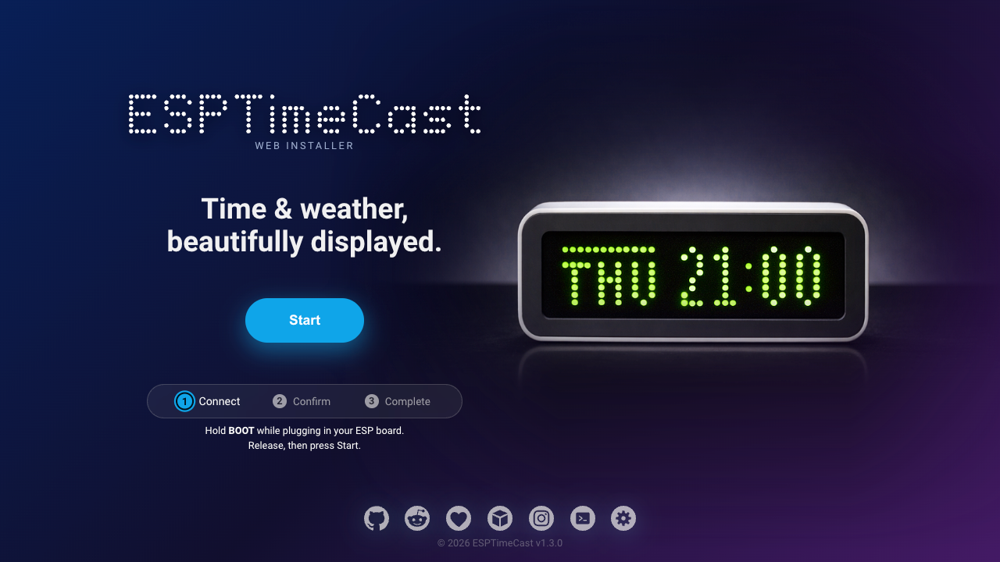

> After flashing, connect to the ESPTimeCast WiFi access point to complete setup.

### ✅ Officially Tested Boards

- Wemos D1 Mini (ESP8266)
- ESP32 Dev Module
- ESP32-C3 SuperMini
- Wemos S2 Mini (ESP32-S2)
- ESP32-S3 WROOM-1 (Camera/SD board)


### Compatible Chip Families

ESPTimeCast supports the following chip families:

- ESP8266
- ESP32
- ESP32-S2
- ESP32-C3
- ESP32-S3 

Other development boards using these chips may work,  
but pin mapping and USB behavior can vary.

&nbsp;
#### 🔄 Updating ESPTimeCast

ESPTimeCast supports two ways to update your device:

#### 🌐 OTA Updates (Wi-Fi)
Update your device wirelessly directly from the Web UI — no cable required.

> Fully supported for devices installed using the Web Installer.  
> Manual installations (e.g. via Arduino IDE) may have limited OTA support.

#### 🔌 Web Installer Updates (USB)
Update your device through the Web Installer using a USB connection.

- Option to **preserve your settings** (no erase)
- Works on all supported devices
- Recommended if OTA is unavailable

> Requires a Web Serial compatible browser (Chrome, Edge, or Brave).

&nbsp;
📌 **Wiring guide:**  
See the [hardware connection table](https://github.com/mfactory-osaka/ESPTimeCast#-advanced-setup--technical-details)

&nbsp;
## 🌐 Now Playing — ESPTimeCast Companion Extension

The **ESPTimeCast Companion Extension** automatically detects what you're watching or listening to and displays it on your device in real time.

Send messages, start timers, and control your display — all directly from your browser, no Web UI required.

- 🎵 Auto-detects music & video titles (YouTube, Spotify, Twitch, and more)
- ⚡ Instantly sends messages and timers from the popup
- 🎛️ Control brightness, modes, and rotation remotely
- 📡 Cast to multiple ESPTimeCast devices at once
- 🔒 Runs locally on your network — fast and private

  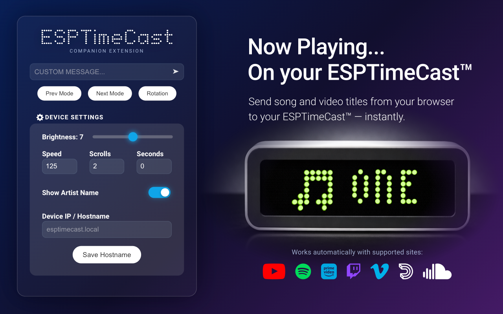


<a href="https://chromewebstore.google.com/detail/esptimecast-companion/oddacoojadbboefmmebihlengjacbbme">
  
</a>

&nbsp;
> Works with **YouTube**, **Spotify**, **Prime Video**, **Vimeo**, **Dailymotion**, **Twitch**, and **SoundCloud**.  
> **Note:** Firmware v1.5.0+ required

&nbsp;
## 📦 3D Printable Case

To help support the project’s development, the official **ESPTimeCast™** case design is available as a **paid STL download** (see links below).  

If you prefer a free option, there are many compatible **MAX7219 LED matrix enclosures** shared by the community - you can find plenty by searching for “MAX7219 case” on Printables, Cults3D, or similar sites.


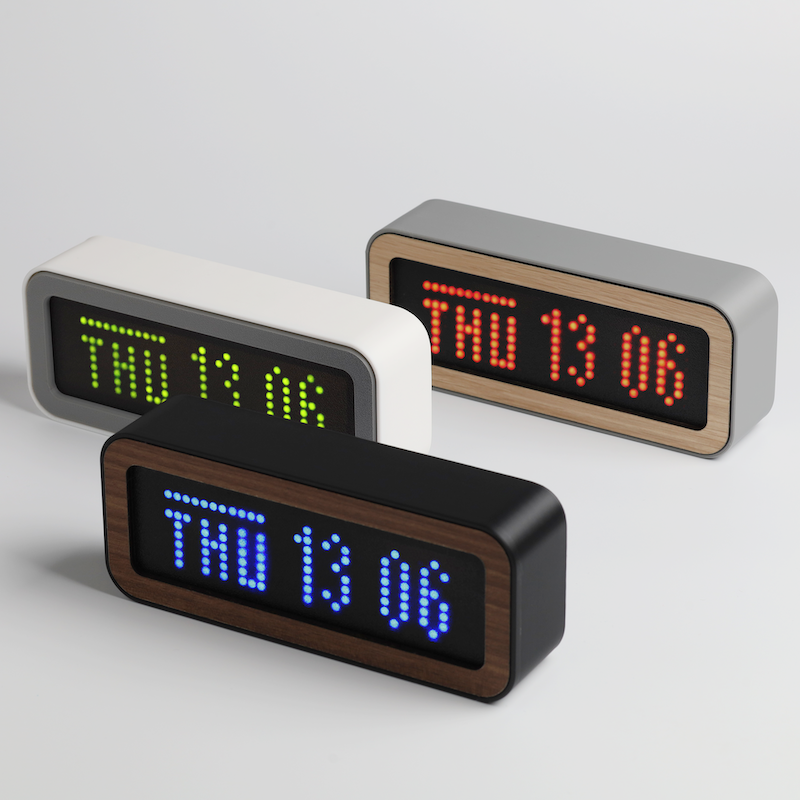

<p align="left">
  <a href="https://www.printables.com/model/1344276-esptimecast-wi-fi-clock-weather-display">
    
  </a>
  <br>
  <a href="https://cults3d.com/en/3d-model/gadget/wifi-connected-led-matrix-clock-and-weather-station-esp8266-and-max7219">
    
  </a>
</p>

&nbsp;
## 🖼️ Community Builds Gallery

A small selection of ESPTimeCast™ builds from the community ❤️  

<p align="center">
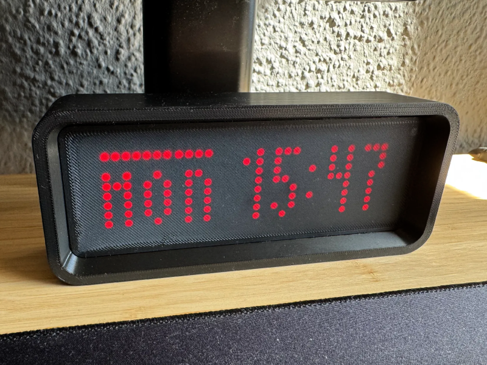 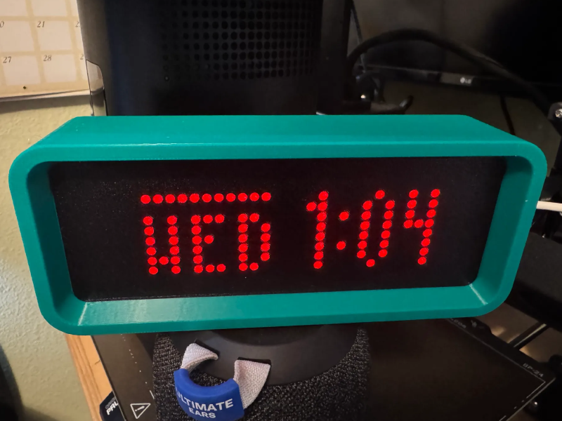 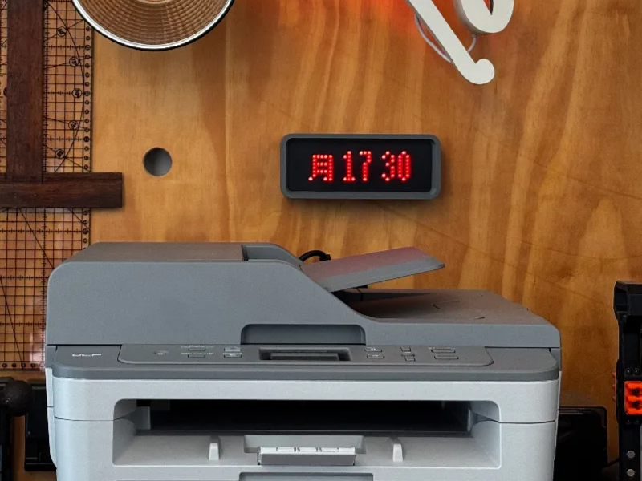 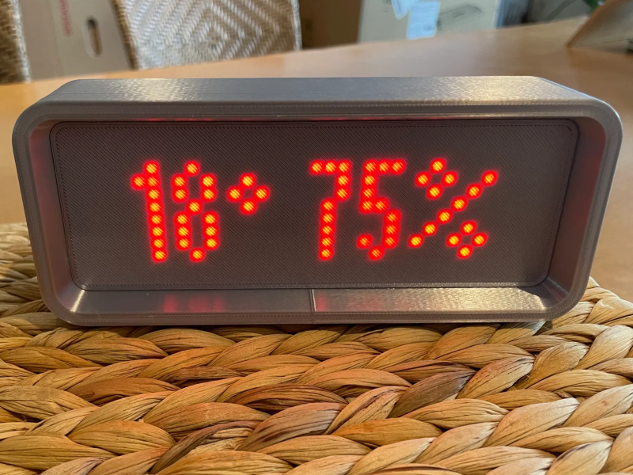 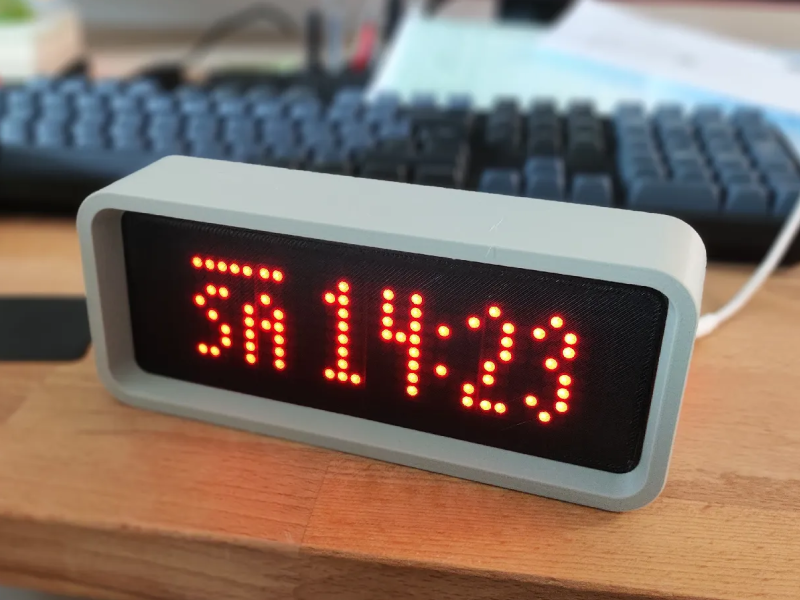 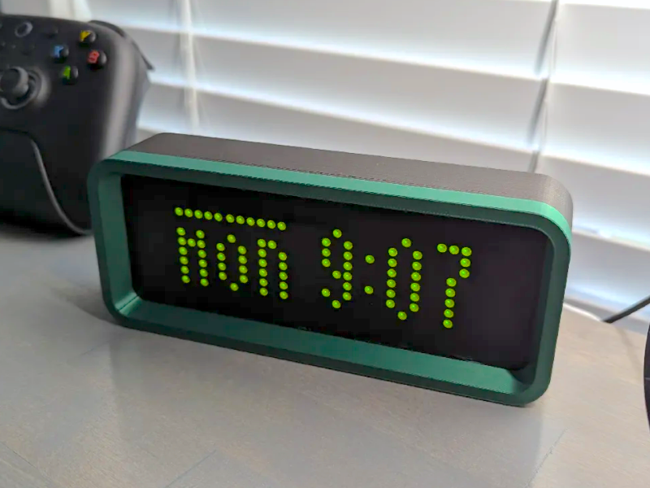 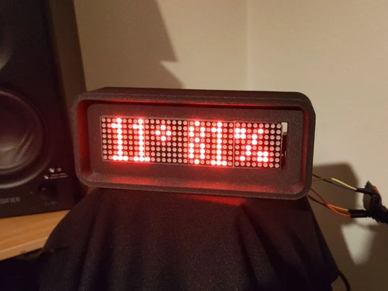 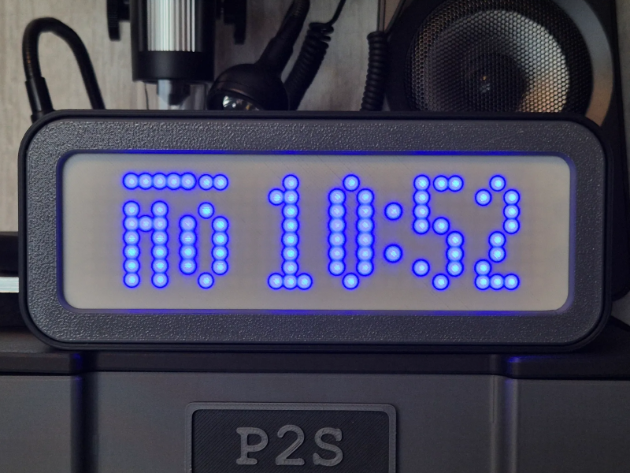 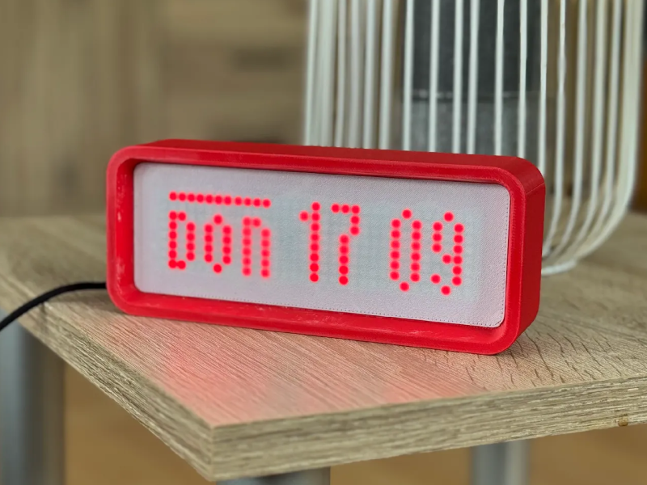 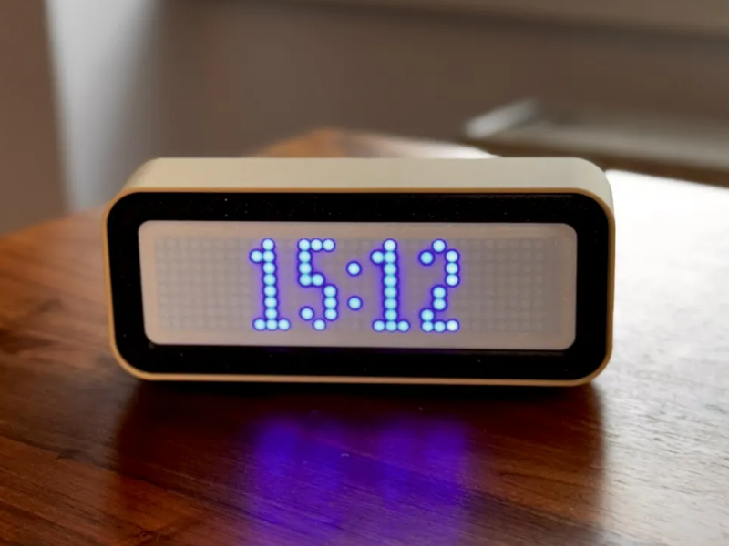 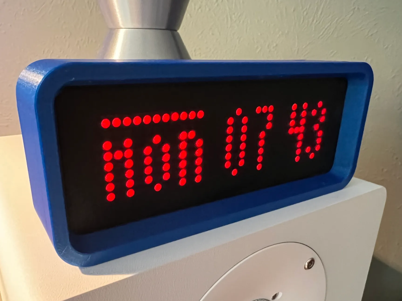 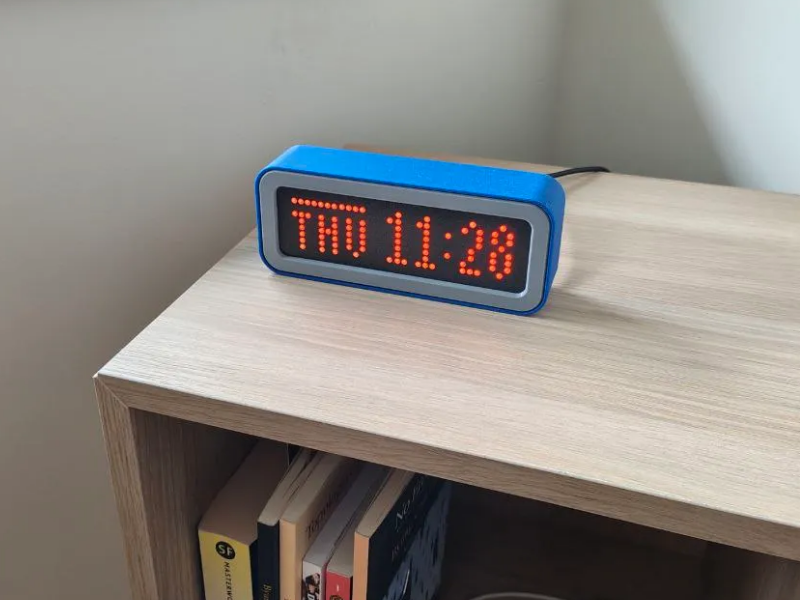
</p>

Huge thanks to all the makers on Printables who shared their ESPTimeCast™ builds featured here:

Achduka, ChrisBalo_2103728, LazyManJoe_199553, LeoB_746630, Manni0605_464156, Purduesi_774301, rhe_3695705, sardaukar_1942598, Stefan_37395, TO3IAS, thirddimensionlabs  

You all made this community showcase possible - thank you! 🙏  

Want your build featured here?  
Share your photos on [r/ESPTimeCast](https://www.reddit.com/r/ESPTimeCast/comments/1p2vt16/show_your_esptimecast_build_post_your_photos_setup/) - I’d love to showcase more builds! 📸

&nbsp;
## 📰 Press Mentions

ESPTimeCast™ has been featured on major maker and tech platforms highlighting its design, usability, and open-source community. 
- [Hackaday](https://hackaday.com/2025/10/02/building-a-desk-display-for-time-and-weather-data)  
- [XDA Developers](https://www.xda-developers.com/super-sleek-esp32-weather-station)
- [Hackster.io](https://www.hackster.io/news/the-perfect-minimalist-led-clock-49a4e4440518)

&nbsp;
## 🛠 Advanced Setup & Technical Details

Most users should start here:
👉 https://esptimecast.github.io

Looking for manual setup, wiring details, or advanced configuration?
Advanced and developer-focused information is available below.  

&nbsp;  
<details>
<summary>✨ Features & Capabilities</summary>
&nbsp;
  
- **8x32 LED Matrix Display** powered by MAX7219 with custom font support  
- **Web-Based Configuration** – no apps required, configure everything from your browser  
- **Accurate Time Sync (NTP)** with automatic retries and status feedback  
- **Live Weather Updates** from OpenWeatherMap (temperature, humidity, conditions)  
- **Custom Scroll Messages** with persistent display control  
- **Countdowns & Timers** – create event countdowns with custom messages or run quick timers (e.g. 15 min)  
- **OTA Firmware Updates** – update your device directly from the browser, no reflashing required
- **Open API & Home Assistant Integration** for automation, remote control, and custom messages  
- **Automatic Setup Mode (AP)** for first-time configuration or recovery  
- **Timezone Support** using IANA database (DST handled automatically)  
- **Location Detection** via “Get My Location” (Lat/Long auto-fill)  
- **Multi-language Support** for weekday and weather descriptions  
- **Persistent Storage (LittleFS)** with backup and restore support  
- **Visual Status Animations** for Wi-Fi, AP mode, and syncing  

- **Advanced Controls & Customization:**
  - Custom **NTP servers** (primary & fallback)  
  - **12/24h clock** and **date display** options  
  - Toggle **weekday**, **humidity**, and **weather descriptions**  
  - **Metric / Imperial units** (°C / °F)  
  - **Display rotation** (180° flip)  
  - Adjustable **brightness**  
  - **Auto dimming** (sunrise/sunset) or custom schedule  

- **Optional Integrations:**
  - **Nightscout glucose display** (alternates with weather)  
  - **Config export/import** via `/export` and `/upload` endpoints  
    
  &nbsp;
</details>
<details>
<summary>🔌 Wiring & Connections</summary>
&nbsp;
  
ESPTimeCast uses **board-specific recommended SPI pin mappings** 
to ensure consistent behavior, stable power delivery, and reliable brightness.

### 📌 Current Pin Assignment

The following pin mappings correspond to the official Web Installer builds.
If you are compiling manually, ensure your pin definitions match this table.

| Chip       | Board / Module                     | CLK | CS | DIN | VCC | GND |
|------------|------------------------------------|:---:|:--:|:---:|:---:|:---:|
| ESP8266    | D1 Mini (USB-C / Micro-USB)        | 14  | 13 | 15  | 5V  | GND |
| ESP32      | ESP32 Dev Module / D1 Mini ESP32 (not ESP8266) | 18 | 23 | 5 | 5V | GND |
| ESP32-S2   | S2 Mini                            | 7   | 11 | 12  | 5V  | GND |
| ESP32-C3   | SuperMini (Updated GPIO Mapping as of v1.3.2)                        | 4   | 10 | 6   | 5V  | GND |
| ESP32-S3   | WROOM-1 (Camera / SD board)        | 18 | 16 | 17  | 5V  | GND |


> The table lists **raw GPIO numbers**.  
> MAX7219 modules are typically powered at **5V** but accept **3.3V logic** on DIN / CLK / CS.  
> All ESP32 boards listed above have been **tested successfully** with this wiring.  
> ESP8266 D1 Mini boards are often labeled using **D-pins** (D5 = GPIO14, D7 = GPIO13, D8 = GPIO15).
> Other boards using the same chip families may work, but SPI pins may differ depending on the manufacturer layout.
> ESP32-C3 SuperMini mapping changed to avoid strapping pin conflicts and boot issues present on some boards.

&nbsp;
### 🧩 Wiring Diagram


> **Tip:** Double-check the pin order on your MAX7219 module — labeling and orientation can vary between manufacturers.

&nbsp;
### 🔄 Upgrading from an older build?

If your device was wired before **Oct 17, 2025**, please verify the following:

- **CLK** is connected to **D5**  
- **VCC** is connected to **5V** (not 3.3V)  
- Flashing via the web installer automatically applies the correct defaults
  
&nbsp;
</details>
<details>
<summary>📶 First-Time Setup (Wi-Fi & AP Mode)</summary>
&nbsp;
  
1. Power on the device. If WiFi fails, it auto-starts in AP mode:
   - **SSID:** `ESPTimeCast`
   - **Password:** `12345678`
   - Captive portal should open automatically, if it doesn't open `http://192.168.4.1` or `http://setup.esp` in your browser.
2. Set your WiFi and all other options.
3. Click **Save Setting** – the device saves config, reboots, and connects.
4. The device shows its local IP address after boot so you can login again for setting changes

> External links and the "Get My Location" button require internet access.  
They won't work while the device is in AP Mode - connect to WiFi first.

&nbsp;
</details>
<details>
<summary>🌐 Web Interface & Settings</summary>
&nbsp;

ESPTimeCast includes a built-in Web UI that lets you fully configure the device from any browser — no apps required.

#### You can open the Web UI using either:

- http://esptimecast.local  
mDNS / Bonjour - Works on macOS, iOS, Windows with Bonjour, and most modern browsers.

- The device’s **local IP address**  
→ On every reboot, ESPTimeCast shows its IP on the LED display so you can easily connect.

#### The Web UI gives you control over:
- **WiFi settings** (SSID & Password)
- **Weather settings** (OpenWeatherMap API key, City, Country, Coordinates)
- **Time zone** (will auto-populate if TZ is found)
- **Day of the Week and Weather Description** languages
- **Display durations** for clock and weather (milliseconds)
- **Custom Scroll Text** - set a persistent scrolling message on the display directly from the Web UI
- **Advanced Settings** (see below)

&nbsp;
## UI Example:
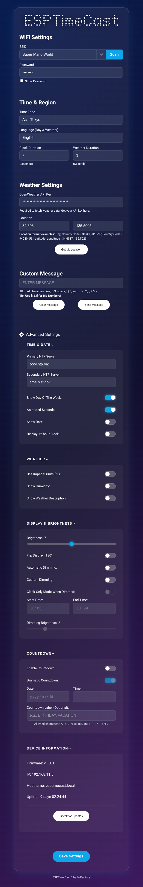  

&nbsp;
</details>
<details>
<summary>⚙️ Advanced Settings & Tweaks</summary>
&nbsp;  
  
Click the **cog icon** next to “Advanced Settings” in the Web UI to reveal extra configuration options.  

**Available advanced settings:**

- **Primary NTP Server**: Override the default NTP server (e.g. `pool.ntp.org`)
- **Secondary NTP Server**: Fallback NTP server (e.g. `time.nist.gov`)
- **Day of the Week**: Display Day of the Week in the desired language
- **Blinking Colon** toggle (default is on)
- **Show Date** (default is off, duration is the same as weather duration)
- **24/12h Clock**: Switch between 24-hour and 12-hour time formats (24-hour default)
- **Imperial Units (°F)** toggle (metric °C defaults)
- **Humidity**: Display Humidity besides Temperature
- **Weather description** toggle (display weather description in the selected language for 3 seconds or scrolls once if description is too long)
- **Flip Display**: Invert the display vertically/horizontally
- **Brightness**: Off - 0 (dim) to 15 (bright)
- **Automatic Dimming Feature** base on Sunrise/Sunset from weather API
- **Custom Dimming Feature**: Start time, end time and desired brightness selection
- **Countdown** function, set a countdown to your favorite/next event, 2 modes: Scroll/Dramatic! 

>Non-English characters converted to their closest English alphabet.   
>For Esperanto, Irish, and Swahili, weather description translations are not available. Japanese translations exist, but since the device cannot display all Japanese characters, English will be used in all these cases.  

> **Tip:** Don't forget to press the save button to keep your settings

&nbsp;
## 📝 Configuration Notes

- **OpenWeatherMap API Key:**
   - [Make an account here](https://home.openweathermap.org/users/sign_up)
   - [Check your API key here](https://home.openweathermap.org/api_keys)
- **City Name:** e.g. `Tokyo`, `London`, etc.
- **Country Code:** 2-letter code (e.g., `JP`, `GB`)
- **ZIP Code:** Enter your ZIP code in the city field and US in the country field (US only)
- **Latitude and Longitude** You can enter coordinates in the city field (lat.) and country field (long.)
- **Time Zone:** Select from IANA zones (e.g., `America/New_York`, handles DST automatically)
  
&nbsp;
</details>
<details>
<summary>🚀 Manual Installation (Arduino IDE)</summary>
&nbsp;
  
There are two ways to install ESPTimeCast:

### 🥇 Recommended: Web Installer (Fastest)
Flash directly from your browser in under a minute:
https://esptimecast.github.io

### 🛠 Manual Installation (Arduino IDE)
If you prefer compiling and uploading manually, follow the instructions below.

#### ⚙️ ESP8266 Setup

Follow these steps to prepare your Arduino IDE for ESP8266 development:

1.  **Install ESP8266 Board Package:**
    * Open `File > Preferences` in Arduino IDE.
    * Add `http://arduino.esp8266.com/stable/package_esp8266com_index.json` to "Additional Boards Manager URLs."
    * Go to `Tools > Board > Boards Manager...`. Search for `esp8266` by `ESP8266 Community` and click "Install".
2.  **Select Your Board:**
    * Go to `Tools > Board` and select your specific board, e.g., **Wemos D1 Mini** (or your ESP8266 variant).
3.  **Configure Flash Size:**
    * Under `Tools`, select `Flash Size "4MB FS:2MB OTA:~1019KB"` or `Flash Size "Mapping defined by Hardware and Sketch"`. This ensures enough space for the sketch and LittleFS data.
4.  **Install Libraries:**
    * Go to `Sketch > Include Library > Manage Libraries...` and install the following:
        * `ArduinoJson` by Benoit Blanchon
        * `MD_Parola` by majicDesigns (this will typically also install its dependency: `MD_MAX72xx`)
        * `ESPAsyncTCP` by ESP32Async
        * `ESPAsyncWebServer` by ESP32Async (3.9.1 or above)  
&nbsp;
#### ⚙️ ESP32 Setup

Follow these steps to prepare your Arduino IDE for ESP32 development:
1.  **Install ESP32 Board Package:**
    * Go to `Tools > Board > Boards Manager...`. Search for `esp32` by `Espressif Systems` and click "Install".
2.  **Select Your Board:**
    * Go to `Tools > Board` and select your specific board, e.g., **LOLIN S2 Mini** (or your ESP32 variant).
3.  **Configure Partition Scheme:**
    * Go to `Tools > Partition Scheme` and choose one of the following:
        * **For OTA support (recommended):**  
          `Minimal SPIFFS (1.9MB APP with OTA / 128KB SPIFFS)`  
          This enables wireless firmware updates via the built-in web interface.
        * **Without OTA support:**  
          `No OTA (2MB APP / 2MB SPIFFS)` or `No OTA (LARGE APP)`  
          These provide a larger filesystem but do not support OTA updates.        
&nbsp;
    > **Note:** OTA works out of the box with the official Web Installer build.  
    > Manual builds are fully supported as well - just make sure you're using the recommended pinout for your specific board as documented in this repository.  
    > **Important:** If the `Minimal SPIFFS` option does not appear, make sure you have selected **Dev Module** for your specific ESP32 chip family (e.g., ESP32 Dev Module, ESP32-S2 Dev Module, ESP32-C3 Dev Module).  

4.  **Install Libraries:**
    * Go to `Sketch > Include Library > Manage Libraries...` and install the following:
        * `ArduinoJson` by Benoit Blanchon
        * `MD_Parola` by majicDesigns (this will typically also install its dependency: `MD_MAX72xx`)
        * `AsyncTCP` by ESP32Async
        * `ESPAsyncWebServer` by ESP32Async
    
&nbsp;
#### ⬆️ Uploading the Code and Data

Once your IDE is ready:

1. **Open the Project Folder**
   * **ESP8266:** Open the `ESPTimeCast_ESP8266` folder and open `ESPTimeCast_ESP8266.ino`.
   * **ESP32:** Open the `ESPTimeCast_ESP32` folder and open `ESPTimeCast_ESP32.ino`.

2. **Upload the Sketch**
   * Click the **Upload** button (right arrow icon) in the Arduino IDE toolbar. This will compile and upload the sketch to your board.
   * **No separate LittleFS upload is needed.** All web UI files are embedded in the sketch.
  
**⚠️ Note for existing users:** If you have previously uploaded /data via LittleFS, you can safely skip that step now — the device will manage config files internally.  

&nbsp;
</details>
<details>
<summary>🏠 API & Home Assistant Integration</summary>
&nbsp;
  
ESPTimeCast exposes a unified `/action` endpoint for all device control — messages, display settings, brightness, timers, navigation, and more. It works with **Home Assistant**, **curl**, the **Chrome Extension**, or any HTTP client.


### 🧠 Message Behavior Overview

#### Web UI messages
- Act as **persistent** messages
- Remain active (even through reboots) until replaced or cleared in the Web UI
- Short messages (up to 8 characters) display **static & centered**, using the Web UI's `Weather Duration` before the display rotates to the next mode
- Long messages scroll `once` per display cycle if no `scrolls` value is sent

#### Home Assistant / API messages
- Are **temporary overrides**
- Do **not** overwrite the persistent Web UI message
- Can automatically expire using `seconds` or `scrolls`
- If neither is sent: short messages use `Weather Duration`, long messages scroll `once` per display cycle

| Source | Behavior | Notes |
|--------|-----------|-------|
| **Home Assistant** | Displays message temporarily | Returns to Clock/Weather rotation if no UI message exists |
| **Web UI** | Displays message persistently until manually cleared | Acts as a permanent banner or ticker |
| **Clear from Web UI** | Clears *all* messages (HA + UI) | Use this to reset the display completely |
| **Clear from HA/API** | Clears only the temporary message | UI message will reappear if one was saved |
| **Scrolls expires** | Automatic clear when limit is reached | Automatically restores the saved UI message |
| **Seconds expires** | Automatic clear when limit is reached | Automatically restores the saved UI message |

**Short messages (up to 8 characters):**
- Display static & centered (no scrolling)
- Uses `seconds` if provided, otherwise `Weather Duration`

**Long messages (8+ characters):**
- Always scroll
- Scrolling stops when `scrolls` limit is reached or when manually cleared

**The "Protected" State:**
- Sending `interrupt=0` creates a protected window — the display refuses new messages until the current one expires
- Use this for critical alerts (e.g., `LEAK DETECTED`) that you don't want overwritten
- A `409 Conflict` response means the display is currently showing a protected message
- To break a lock: send an empty message, use the Web UI Clear button, or send a new message with `interrupt=0`

&nbsp;

### ⚡ `/action` Endpoint

Supports both GET and POST. Send a parameter name alone to toggle, or with a value to set explicitly.

#### 🔗 Endpoint
```
GET  http://<device_ip>/action?<parameter>
GET  http://<device_ip>/action?<parameter>=<value>
POST http://<device_ip>/action
```

#### 💬 Messages

| Parameter | Value | Description |
|-----------|-------|-------------|
| `message` | string | Display a message. Send empty string `""` to clear. |
| `speed` | `10`–`200` | Scroll speed. Lower = faster. Default: `80` |
| `scrolls` | `0`–`100` | Scroll cycles. `0` = infinite. Default: `0` |
| `seconds` | `0`–`3600` | Auto-clear after N seconds. `0` = use Weather Duration. |
| `bignumbers` | `0` or `1` | Use large number font. |
| `interrupt` | `0` or `1` | `0` = protect message from being overwritten. Returns `409` if busy. Default: `1` |

#### 🧭 Navigation

| Parameter | Value | Description |
|-----------|-------|-------------|
| `next_mode` | -- | Advance to next display mode |
| `prev_mode` | -- | Go to previous display mode |
| `go_to_mode` | `0`–`6` or name | Jump to a mode: `clock`, `weather`, `description`, `countdown`, `date`, `nightscout`, `message` |
| `enable_rotation` | `0` or `1` (optional) | Freeze or resume automatic rotation. Toggles if no value sent. |

#### 🔆 Display & Brightness

| Parameter | Value | Description |
|-----------|-------|-------------|
| `brightness` | `0`–`15` | Set brightness |
| `brightness_up` | -- | Increase brightness by 1 |
| `brightness_down` | -- | Decrease brightness by 1 |
| `display_off` | -- | Toggle display on/off |
| `flip`| `0` or `1` (optional) | Flip display 180°. Toggles if no value sent. |

#### 🕐 Clock & Time

| Parameter | Value | Description |
|-----------|-------|-------------|
| `twelve_hour` | `0` or `1` (optional) | Toggle 12/24h clock |
| `show_dayofweek` | `0` or `1` (optional) | Toggle day of week display |
| `show_date` | `0` or `1` (optional) | Toggle date display |
| `animated_seconds` | `0` or `1` (optional) | Toggle animated seconds |

#### 🌤️ Weather

| Parameter | Value | Description |
|-----------|-------|-------------|
| `humidity`| `0` or `1` (optional) | Toggle humidity display |
| `weatherdesc` | `0` or `1` (optional) | Toggle weather description |
| `units` | `0` or `1` (optional) | Toggle imperial/metric units |
| `imperial` | -- | Set imperial units |
| `metric` | -- | Set metric units |
| `language` | e.g. `en`, `ja`, `sv` | Set display language |

#### ⏱️ Timer

| Parameter | Value | Description |
|-----------|-------|-------------|
| `timer` | e.g. `5M`, `1H30M`, `90S` | Start a timer |
| `timer_stop` / `timer_cancel` | -- | Stop and clear timer |
| `timer_pause` | -- | Pause running timer |
| `timer_resume` / `timer_start` | -- | Resume paused timer |
| `timer_restart` | -- | Restart timer from original duration |

#### ⚙️ System

| Parameter | Value | Description |
|-----------|-------|-------------|
| `clear_message` | -— | Clear current message, restore persistent UI message |
| `save` | —- | Persist current settings to flash |
| `restart` | -— | Reboot the device |

> **Toggle behavior:** Sending a parameter without a value toggles it and jumps to the relevant display mode. 
&nbsp;

&nbsp;

### 🏠 Home Assistant Setup

Add this to your `configuration.yaml`:
```yaml
rest_command:
  esptimecast:
    url: "http://<device_ip>/action"
    method: POST
    content_type: "application/x-www-form-urlencoded"
    payload: "{{ payload }}"
```

Then restart Home Assistant.

#### ⚙️ Example Automations

**1. Send a notification with auto-clear:**
```yaml
alias: Notify Door Open
trigger:
  - platform: state
    entity_id: binary_sensor.front_door
    to: "on"
action:
  - service: rest_command.esptimecast
    data:
      payload: "message=DOOR OPEN&seconds=15"
```

**2. Send a protected priority message:**
```yaml
alias: Notify Leak Detected
trigger:
  - platform: state
    entity_id: binary_sensor.water_leak
    to: "on"
action:
  - service: rest_command.esptimecast
    data:
      payload: "message=LEAK DETECTED&scrolltimes=5&ainterrupt=0"
```

**3. Freeze display while media plays:**
```yaml
alias: Freeze ESPTimeCast during media
action:
  - service: rest_command.esptimecast
    data:
      payload: "enable_rotation=0"
```

**4. Start a 10 minute timer:**
```yaml
action:
  - service: rest_command.esptimecast
    data:
      payload: "timer=10M"
```

**5. Dim display at night:**
```yaml
alias: Dim ESPTimeCast at Night
trigger:
  - platform: time
    at: "23:00"
action:
  - service: rest_command.esptimecast
    data:
      payload: "display_off"
```

**6. Send message with Smart Retry (Handling 409):**
```yaml
alias: Notify Mail with Retry
trigger:
  - platform: state
    entity_id: binary_sensor.mailbox
    to: "on"
action:
  - repeat:
      while:
        - condition: template
          value_template: "{{ repeat.index <= 5 and (not is_defined(wait_result) or wait_result.status == 409) }}"
      sequence:
        - service: rest_command.esptimecast
          data:
            payload: "message=YOU HAVE MAIL&scrolls=2"
          response_variable: wait_result
          continue_on_error: true
        - if:
            - condition: template
              value_template: "{{ wait_result.status == 409 }}"
          then:
            - delay: "00:00:10"
```

### ⚡ curl Examples
```bash
# Send a message
curl -X POST -d "message=HELLO WORLD&scrolls=3" "http://<device_ip>/action"

# Protected message
curl -X POST -d "message=LEAK DETECTED&scrolls=5&interrupt=0" "http://<device_ip>/action"

# Test 409 (run while a protected message is scrolling)
curl -v -X POST -d "message=TRYING" "http://<device_ip>/action"

# Start a timer
curl "http://<device_ip>/action?timer=5M"

# Jump to clock mode
curl "http://<device_ip>/action?go_to_mode=clock"

# Set brightness
curl "http://<device_ip>/action?brightness=8"

# Toggle 12-hour clock
curl "http://<device_ip>/action?twelve_hour"

# Turn display off
curl "http://<device_ip>/action?display_off"
```

### 🧾 Notes

- Allowed characters: A-Z, 0-9, space, and symbols `: ! ' . , _ + % / ? [ ] ° # @ ^ ~ * = < > { } \ - & $ |`
- All text is automatically converted to **uppercase**
- If both `seconds` and `scrolls` are set, the message clears when the **first condition** is met
- A new message with `interrupt=0` always overrides a currently protected message

#### ✅ Example Use Cases

- Temporary alerts like **DOOR OPEN**, **RAIN STARTING**, or **MAIL DELIVERED**
- Persistent ticker messages from the Web UI like **WELCOME HOME** or **ESPTIMECAST LIVE**
- Combine both: Web UI for a base banner, HA for transient automation messages
- Freeze the display during media playback using `enable_rotation=0`

> **ℹ️ Legacy Endpoint:** The `/set_custom_message` endpoint from previous versions is still supported for backwards compatibility. New integrations should use `/action` instead.

&nbsp;
</details>
<details>
<summary> 🔘 Physical Button (Optional)</summary>
&nbsp;

ESPTimeCast supports an optional physical button that can be wired directly to your ESP board for hands-free control — no app or network required.

The button template is included in the firmware but **disabled by default**. To enable it, simply uncomment the relevant lines and choose your GPIO pin.

### Wiring

Connect a momentary push button between your chosen GPIO pin and **GND**. The firmware uses the internal pull-up resistor — no external resistor needed.
```
ESP GPIO pin  ──────────────  Button  ──────────────  GND
```

### Setup

In the firmware, find the **PHYSICAL BUTTON TEMPLATE** section and:

1. Uncomment `#define BUTTON_PIN 4` and change `4` to your GPIO pin
2. Uncomment the `handleButton()` function
3. Uncomment the `pinMode` line in `setup()`
4. Uncomment the `handleButton()` call in `loop()`

### Default Behavior

| Press | Default Action | 
|-------|----------------|
| **Short press** | Advance to next display mode |
| **Long press** (800ms+) | Toggle display on/off |

### Customization

Both actions can be replaced with any `/action` parameter. Some examples:
```cpp
// Short press examples:
executeAction("prev_mode", "");         // Go to previous mode
executeAction("brightness_up", "");     // Increase brightness
executeAction("enable_rotation", "");   // Toggle rotation freeze
executeAction("go_to_mode", "clock");   // Jump to clock

// Long press examples:
executeAction("restart", "");           // Reboot device
executeAction("brightness_down", "");   // Decrease brightness
executeAction("go_to_mode", "clock");   // Jump to clock
executeAction("enable_rotation", "");   // Toggle rotation freeze
```

> See the full list of available actions in the API & Home Assistant Integration section.

### Notes
- The long press threshold defaults to **800ms** — change `BUTTON_LONG_PRESS_MS` to adjust
- Short press fires on **button release** to avoid conflict with long press
- Any GPIO pin can be used — check your board's pinout for available pins
- ESP8266 D-pin labels map to GPIO numbers (e.g. D2 = GPIO4)
  
&nbsp;
</details>
<details>
<summary>🎨 Icons & Custom Font</summary>
&nbsp;
  
ESPTimeCast™ v1.2.3 introduces **65 new icons** you can use in:

- **Home Assistant messages** – send temporary or scrollable messages with visual icons.  
- **Web UI custom messages** – include icons in persistent or scrolling text.  

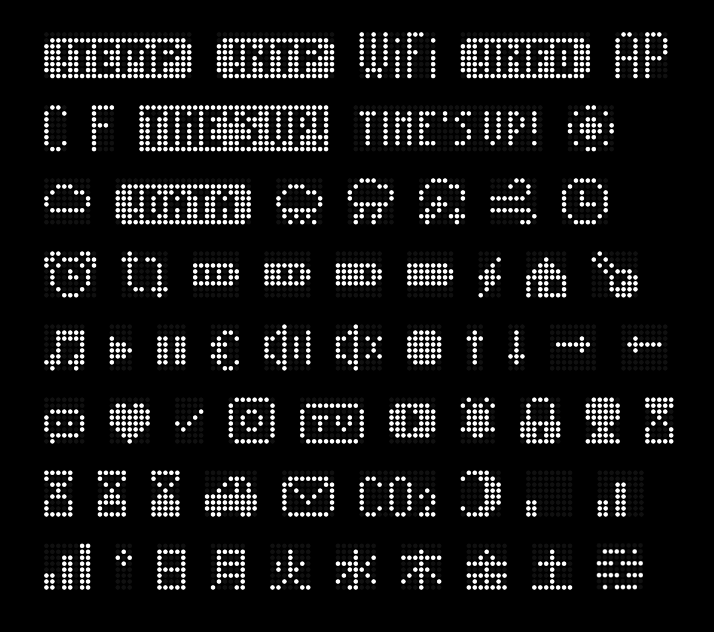

**Full Icons List**  
[NOTEMP][NONTP][WIFI][INFO][AP]  
[C][F][TIMEISUP][TIMEISUPINVERTED][SUNNY]  
[CLOUDY][NODATA][RAINY][THUNDER][SNOWY][WINDY][CLOCK]  
[ALARM][UPDATE][BATTERYEMPTY][BATTERY33][BATTERY66][BATTERYFULL][BOLT][HOUSE][TEMP]  
[MUSICNOTE][PLAY][SPACE][PAUSE][EURO][SPEAKER][SPEAKEROFF][RED][UP][DOWN][RIGHT][LEFT]  
[TALK][HEART][CHECK][INSTA][TV][YOUTUBE][BELL][LOCK][PERSON][HOURGLASS]  
[HOURGLASS25][HOURGLASS75][HOURGLASSFULL][CAR][MAIL][CO2][MOON][SIGNAL1][SIGNAL2]  
[SIGNAL3][DEG][SUNDAYJP][MONDAYJP][TUESDAYJP][WEDNESDAYJP][THURSDAYJP][FRIDAYJP][SATURDAYJP][MIST]

**How to use icons:**  
- Wrap the icon name in **brackets**: `[SUNNY] [YOUTUBE]`  
- Short messages (≤8 chars) = static & centered; longer = scrolling  
- Requires `mfactoryfont.h`; otherwise firmware falls back to Basic Font  
> For context, see: [Weird_font_displaying?_Heres_why_how_to_fix_it](https://www.reddit.com/r/ESPTimeCast/comments/1re6wh4/weird_font_displaying_heres_why_how_to_fix_it/)

&nbsp;
</details>
<details>
<summary>⏱️ Timer Feature</summary>
&nbsp;
  
ESPTimeCast includes a built-in countdown timer that can be triggered via the **Custom Message** field in the Web UI or through **Home Assistant** (or any HTTP client).

### Starting a Timer

Send a custom message using the `[TIMER]` token with your desired duration:

| Format | Example | Description |
|--------|---------|-------------|
| `[TIMER xxH]` | `[TIMER 2H]` | 2 hours |
| `[TIMER xxM]` | `[TIMER 30M]` | 30 minutes |
| `[TIMER xxS]` | `[TIMER 90S]` | 90 seconds |
| `[TIMER xxHxxM]` | `[TIMER 1H30M]` | 1 hour 30 minutes |
| `[TIMER xxHxxMxxS]` | `[TIMER 1H30M45S]` | 1 hour 30 minutes 45 seconds |
| `[TIMER xx]` | `[TIMER 5]` | 5 minutes (number only defaults to minutes) |

You can include the timer token in a message:
```
PIZZA IS READY IN [TIMER 20M]
```
> Note: The timer starts immediately and takes over the display.  
> Any message text is ignored while the timer is running.

### Timer Commands

Once a timer is running, you can control it by sending the following as a custom message:

| Command | Description |
|---------|-------------|
| `[TIMER STOP]` or `[TIMER CANCEL]` | Stops the timer and returns to clock |
| `[TIMER PAUSE]` | Pauses the timer at the current time |
| `[TIMER RESUME]` or `[TIMER START]` | Resumes a paused timer |
| `[TIMER RESTART]` | Restarts the timer from its original duration |

### Behavior

- The timer **always overrides the display** while running  
- Only messages sent with `allowInterrupt=0` can override the timer  
- When the timer reaches zero, an alarm animation plays for 5 seconds before returning to the clock  
- Timer state is **not persisted** across reboots  

### Home Assistant Example
```yaml
service: rest_command.esptimecast_message
data:
  message: "[TIMER 20M]"
```
### curl Example
```bash
# Start a 5 second timer
curl -X POST -d "message=[TIMER 5S]" "http://esptimecast.local/set_custom_message"

# Start a timer with a message
curl -X POST -d "message=PIZZA IS READY IN [TIMER 20M]" "http://esptimecast.local/set_custom_message"

# Pause the timer
curl -X POST -d "message=[TIMER PAUSE]" "http://esptimecast.local/set_custom_message"

# Stop the timer
curl -X POST -d "message=[TIMER STOP]" "http://esptimecast.local/set_custom_message"
```

> Replace `esptimecast.local` with your device's IP address if mDNS is not available on your network.

&nbsp;
</details>
<details>
<summary>🧩 Power User Features</summary>
&nbsp;

ESPTimeCast™ includes a few optional “power-user” features that aren’t visible in the main interface but can be accessed directly from your browser. These are intended for advanced users who want more control or integration.

#### ⚙️ /factory_reset
Erases all saved configuration data, Wi-Fi credentials, and uptime history.
Used to restore the device to its original state. Only available in **AP mode**.

**Example:**  
```
http://192.168.4.1/factory_reset
```

#### 💾 /export
Downloads your current configuration (`config.json`) directly from the device.  
This is useful for creating backups or migrating settings between devices.

**Example:**  
```
http://your-device-ip/export
```
The file will download automatically with your saved WiFi credentials (safely masked for security) and all other settings.

#### 📂 /upload
Lets you manually upload a configuration file (`config.json`) to the device.  
Perfect for restoring a backup or quickly switching between setups.

**Usage:**
1. Go to  
   ```
   http://your-device-ip/upload
   ```
2. Select your edited or backup `config.json` file.  
3. The device will confirm the upload and automatically reboot with the new configuration.

> *Tip:* You can export → edit the file on your computer → re-upload to test new settings without using the web interface.


#### ⚕️ Nightscout Integration
ESPTimeCast supports displaying glucose data from **Nightscout** servers alongside weather information.

When the secondary NTP/URL field (`ntpServer2`) contains a valid Nightscout API endpoint for example:  
```
https://your-cgm-server/api/v1/entries/current.json?token=xxxxxxxxxxxxx
```
the device automatically enables **Glucose Display Mode**.

In this mode:
- The device fetches glucose data every 5 minutes.
- Glucose value and trend direction are displayed alternately with time and weather.
- The display duration for Nightscout data is the same as the weather display duration.
- Weather data continues to display normally.
- Debug logs confirm updates and Nightscout responses in the Serial Monitor.

#### ⚠️ Notes
- These features are optional and hidden from the main interface to avoid clutter.  
- `/upload` and `/export` are intentionally unlinked from the UI to prevent accidental access.  
- Always verify your WiFi credentials and tokens before uploading edited configurations.
  
&nbsp;
</details>
<details>
<summary>📺 How the Display Works</summary>
&nbsp;

**ESPTimeCast™** automatically switches between two display modes: Clock and Weather.
If "Show Weather Description" is enabled, a third mode (Description) will display with a duration of 3 seconds, if the description is too long to fit on the display the description will scroll from right to left once.

What you see on the LED matrix depends on whether the device has successfully fetched the current time (via NTP) and weather (via OpenWeatherMap).  
The following table summarizes what will appear on the display in each scenario:

| Display Mode | 🕒 NTP Time | 🌦️ Weather Data | 📺 Display Output                              |
|:------------:|:----------:|:--------------:|:--------------------------------------------|
| **Clock**    | ✅ Yes      | —              | 🗓️ Day Icon + ⏰ Time (e.g. `@ 14:53`)           |
| **Clock**    | ❌ No       | —              |  `! NTP` (NTP sync failed)               |
| **Weather**  | —          | ✅ Yes         | 🌡️ Temperature (e.g. `23ºC`)                |
| **Weather**  | ✅ Yes      | ❌ No          | 🗓️ Day Icon + ⏰ Time (e.g. `@ 14:53`)           |
| **Weather**  | ❌ No       | ❌ No          |  `! TEMP` (no weather or time data)       |

#### How it works:

- The display automatically alternates between **Clock** and **Weather** modes (the duration for each is configurable).
- If "Show Weather Description" is enabled a third mode **Description** will display after the **Weather** display with a duration of 3 seconds.
- In **Clock** mode, if NTP time is available, you’ll see the current time plus a unique day-of-week icon. If NTP is not available, you'll see `! NTP`.
- In **Weather** mode, if weather is available, you’ll see the temperature (like `23ºC`). If weather is not available but time is, it falls back to showing the clock. If neither is available, you’ll see `! TEMP`.
- All status/error messages (`! NTP`, `! TEMP`) are big icons shown on the display.

**Legend:**
- 🗓️ **Day Icon**: Custom symbol for day of week (`@`, `=`, etc.)
- ⏰ **Time**: Current time (HH:MM)
- 🌡️ **Temperature**: Weather from OpenWeatherMap
- ✅ **Yes**: Data available
- ❌ **No**: Data not available
- — : Value does not affect this mode
  
&nbsp;
</details>

&nbsp;
## 📣 Community & Help
If you need assistance, want to share your build, or discuss new features:  
👉 Join the ESPTimeCast Community on Reddit: [r/ESPTimeCast](https://www.reddit.com/r/ESPTimeCast/)
&nbsp;  
&nbsp;
## 🤝 Contributing
ESPTimeCast is a personal project, and to keep the codebase focused, stable, and aligned with the original vision, I’m not accepting pull requests at this time.  

If you have ideas, feature requests, bug reports, or improvements, please open an Issue instead - discussion is always welcome.  

**Forks, custom additions, and personal experiments are absolutely encouraged.** Feel free to build on ESPTimeCast in your own fork and make it your own 😉
&nbsp;  
&nbsp;
## 🛡️ Branding & Visual Policy

ESPTimeCast™ is an open-source project, but its **name, logo, and visual identity are protected**.

#### ✅ You are welcome to:
- Build and sell compatible hardware  
- Modify the firmware for personal or educational use  
- Share your builds with the community  

#### ❌ You may not:
- Use the **ESPTimeCast™ name or logo** in product listings  
- Present your product as an official ESPTimeCast™ device  
- Use **official firmware visuals** (custom font, icons, display style) in commercial photos  

#### 🏷 Recommended wording for listings:
> “ESPTimeCast™ compatible – unofficial build”

#### 🎨 About Firmware Visuals

The ESPTimeCast™ visual design (including fonts, icons, and display styling) is part of the project’s identity.

- Free to use for personal projects  
- Not allowed in commercial product listings without permission  

#### 💡 Why this matters

The firmware has a distinctive look.  
Using it in product photos can make unofficial builds appear as official products.

This policy keeps:
- The ESPTimeCast™ identity clear  
- Community builds open and encouraged  

#### ⚖️ License Note

The firmware code is licensed under **GPL-3.0** (subject to change in future versions).  
This does **not** grant rights to use ESPTimeCast™ branding or visuals commercially.  

&nbsp;
## ❤️ Support this project
ESPTimeCast is an open-source passion project that blends art, engineering, and design.  
If you enjoy it, you can help keep the project growing - even something as simple as leaving a ⭐ on GitHub goes a long way.  

If you'd like to go a step further, you can also support development through the options below:

[](https://www.buymeacoffee.com/mfactory)  
[](https://www.paypal.me/officialuphoto)  
[](https://github.com/sponsors/mfactory-osaka)   
&nbsp;
&nbsp;
## 📜 License Change Notice
As of v1.5.0, ESPTimeCast is no longer licensed under GPL-3.0.  
It is now source-available for personal, non-commercial use only.  
Previous versions (v1.4.2 and earlier) remain under their original GPL-3.0 license.  
For commercial licensing inquiries contact mario.felipe.tf@gmail.com

      


